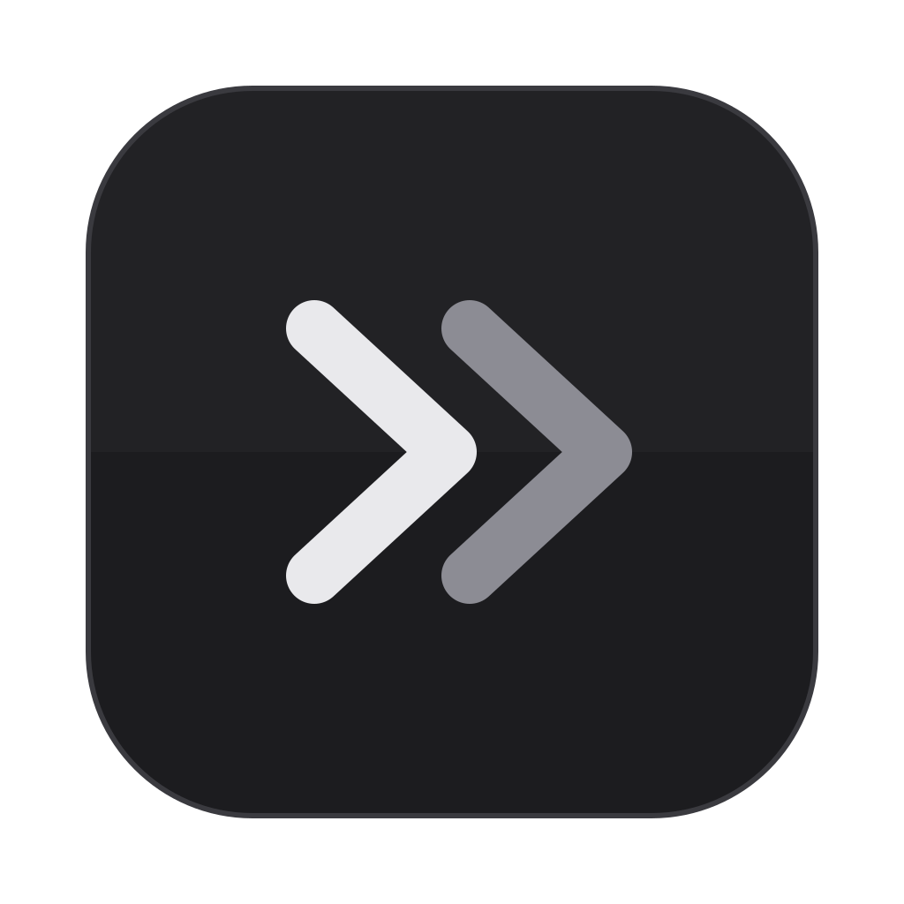
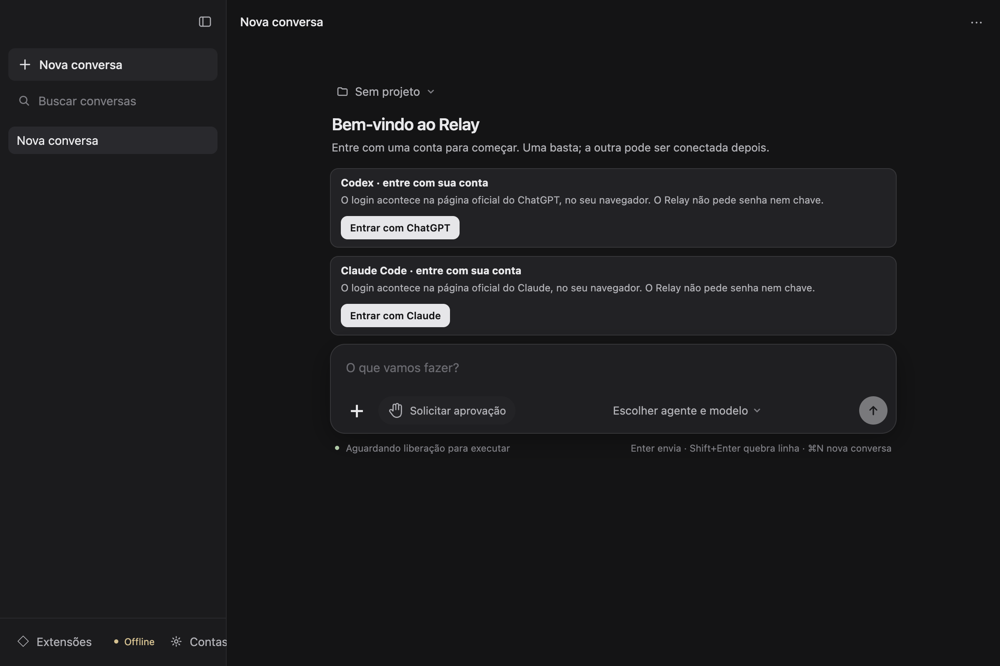

<div align="center">
  
  <h1>Relay</h1>
  <p><strong>Dois agentes. Uma conversa.</strong></p>
  <p>Codex e Claude Code no seu Mac.<br />Suas contas, seus projetos e um lugar para continuar o trabalho.</p>
  <br />
  <p>
    <a href="https://github.com/ArthurMalucelli/relay/releases/download/v1.0.0-preview.20260928/Relay-1.0.0-09bf98c9fa03-arm64.zip"><strong>↓ Baixar para Mac · ZIP</strong></a>
    &nbsp;&nbsp;·&nbsp;&nbsp;
    <a href="INSTALL.md">Instalação</a>
    &nbsp;&nbsp;·&nbsp;&nbsp;
    <a href="https://github.com/ArthurMalucelli/relay/releases">Versões</a>
    &nbsp;&nbsp;·&nbsp;&nbsp;
    <a href="https://github.com/ArthurMalucelli/relay/issues/new">Suporte</a>
  </p>
  <p><sub>macOS 13+ &nbsp; / &nbsp; Apple Silicon &nbsp; / &nbsp; Prévia 1.0.0 &nbsp; / &nbsp; 348 MB</sub></p>
</div>

---

## Seu trabalho continua aqui

Escolha o agente e o modelo para cada etapa. O Relay mantém as conversas organizadas e leva o contexto público do trabalho quando você troca entre Codex e Claude Code.

| Na conversa | No seu espaço |
| :--- | :--- |
| **Troque de agente**<br />Continue a conversa com outro agente ou modelo, usando histórico público e referências locais. | **Organize seus projetos**<br />Conversas, pastas e rascunhos separados, com busca, arquivamento e restauração. |
| **Ajuste o raciocínio**<br />Selecione o nível de esforço oferecido pelo modelo. | **Trabalhe com arquivos**<br />Anexe documentos e imagens; leia respostas com Markdown e fórmulas. |
| **Escolha como aprovar**<br />Solicite aprovação, use o modo automático ou escolha Dangerous mode quando disponível. | **Traga suas extensões**<br />Instale ou importe skills, plugins e MCP compatíveis na biblioteca do Relay. |

<details>
<summary><strong>Veja a interface</strong></summary>
<br />

<p><sub>Captura do aplicativo em um ambiente de demonstração offline, sem contas ou conversas pessoais. O catálogo e a disponibilidade dos agentes dependem da sua conta.</sub></p>
</details>

## Instalação

1. **[Baixe o ZIP](https://github.com/ArthurMalucelli/relay/releases/download/v1.0.0-preview.20260928/Relay-1.0.0-09bf98c9fa03-arm64.zip)** e dê dois cliques para descompactar.
2. Mova **Relay.app** para **Aplicativos** e abra.
3. Em **Contas**, entre com ChatGPT ou Claude pela página oficial e comece a conversar.

Você precisa de um **Mac com chip Apple M1 ou posterior**, internet e uma conta com acesso ao respectivo agente. Pode começar com um só. O macOS 13 é o mínimo declarado pelo app; não há teste em todas as versões.

**Sem Node, Homebrew ou compilação para conversar.** [Guia completo](INSTALL.md) · [Preferir DMG](https://github.com/ArthurMalucelli/relay/releases/download/v1.0.0-preview.20260928/Relay-1.0.0-09bf98c9fa03-arm64.dmg)

<details>
<summary><strong>Prefere baixar pelo Terminal?</strong></summary>

```sh
curl --fail --location 'https://github.com/ArthurMalucelli/relay/releases/download/v1.0.0-preview.20260928/Relay-1.0.0-09bf98c9fa03-arm64.zip' \
  --output "$HOME/Downloads/Relay-1.0.0-09bf98c9fa03-arm64.zip" &&
open "$HOME/Downloads/Relay-1.0.0-09bf98c9fa03-arm64.zip"
```

Depois, mova o app extraído para **Aplicativos**. `git clone` baixa apenas a documentação deste repositório; o aplicativo pronto está nos downloads da versão. Não escolha os arquivos “Source code”.

</details>

## Suas contas. Seu Mac.

O Relay usa suas próprias contas, pelos componentes oficiais dos provedores. Não inclui assinatura nem oferece uso ilimitado; modelos e consumo seguem o seu plano. Não há alternativa de inferência por chave de API.

Conversas e rascunhos ficam no Mac. As mensagens e os arquivos usados na conversa podem ser enviados ao agente escolhido e aos serviços MCP que você ativar. **Armazenamento local não significa processamento offline.**

<details>
<summary>Dados, permissões e extensões</summary>

- O perfil fica em `~/Library/Application Support/Relay`. O download não leva contas, credenciais ou conversas do desenvolvedor. Não há sincronização entre computadores.
- A troca de agente compartilha contexto público e referências locais; não transfere raciocínio privado nem a sessão interna completa do outro provedor. Não usa JEV.
- Para começar, use **Solicitar aprovação**. **Dangerous mode** permite ações sem a revisão normal, inclusive comandos fora da pasta do projeto; use apenas se aceitar esse acesso. Restrições nativas continuam valendo.
- Extensões são revisadas antes de instalar e começam desativadas. Mantêm configuração própria no Relay e podem exigir novo login oficial. MCP no Claude ainda pede aprovação em modo automático.
- A importação preserva a origem. Configurações com credenciais ou campos incompatíveis exigem cadastro próprio. Programas exigidos por um MCP de terceiros não vêm necessariamente no pacote.

</details>

## Documentação e suporte

| Precisa de… | Vá para |
| :--- | :--- |
| Instalar, entrar ou resolver um erro | [Guia de instalação](INSTALL.md) |
| Conferir o que mudou e o que foi testado | [Notas da versão](RELEASE-NOTES.md) |
| Verificar o download | [Checksums](SHA256SUMS.txt) · [Manifesto](release-manifest.json) |
| Entender componentes e licenças | [Avisos de terceiros](THIRD-PARTY-NOTICES.md) |
| Reportar um problema | [Abrir issue](https://github.com/ArthurMalucelli/relay/issues/new) |

Ao reportar, inclua chip do Mac, versão do macOS, build em **Contas** e mensagem de erro. Oculte informações pessoais nas capturas; não publique credenciais nem o diretório do perfil.

## Limites desta versão

<details>
<summary>Compatibilidade, validação e estado da prévia</summary>

- **Abertura no macOS:** pacote sem assinatura Developer ID/notarização; a avaliação Gatekeeper rejeitou o candidato no Mac de desenvolvimento. Veja [os avisos de instalação](INSTALL.md#aviso-de-segurança-do-macos). ZIP e DMG contêm o mesmo app e estão sujeitos às mesmas verificações do macOS.
- **Claude:** login e respostas por assinatura funcionaram localmente. A confirmação das condições de distribuição para esta integração com o Agent SDK ainda está pendente; funcionamento técnico não equivale a autorização. [Fontes](THIRD-PARTY-NOTICES.md).
- **Validação externa:** instalação e uso por outra pessoa em outro Mac ainda não foram confirmados. OAuth de um MCP externo em navegador não foi validado; MCP de plugin Claude não oferece login pela rota atual.
- **Plataformas e atualizações:** apenas macOS Apple Silicon nesta prévia. Atualizações manuais por [Releases](https://github.com/ArthurMalucelli/relay/releases), preservando o perfil.
- **Build `09bf98c9fa03`:** 612 testes automatizados e 22 verificações de instalação pelo DMG em perfil vazio no mesmo Mac. Houve aceitação real dos dois agentes e extensões. O ZIP preservou os 6.361 arquivos, 14 links simbólicos e permissões do app no DMG; integridade profunda aprovada. Não é validação de outra máquina.

</details>

---

<p align="center"><sub>Relay é um projeto independente, sem afiliação com OpenAI, Anthropic ou Apple.<br />Este repositório contém documentação e downloads; o código-fonte completo do aplicativo não está publicado aqui.</sub></p>
